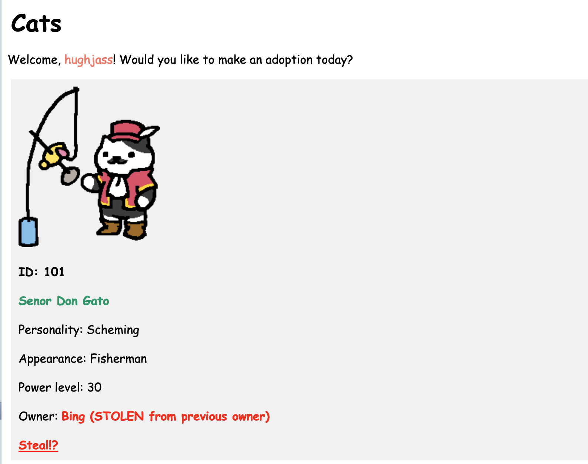

# The Cat Adoption Agency

The Cat Adoption Agency is a web app built using Python and Flask with SQLite
as the database engine of choice, using Google Gemini's generative AI
capabilities to provide a simple but dynamic virtual pet adoption experience
for users. The goal of the game is to acquire as many cats as possible via
legal or illegal adoption means. Users can compete for spots on the leaderboard
and steal cats from each other if desired. Each cat has a unique personality
and appearance, and users will learn different things about a cat each time
they visit their page.

You can visit the website at [catadoption.wtf](http://catadoption.wtf) to give
it a try!

Happy adopting.

